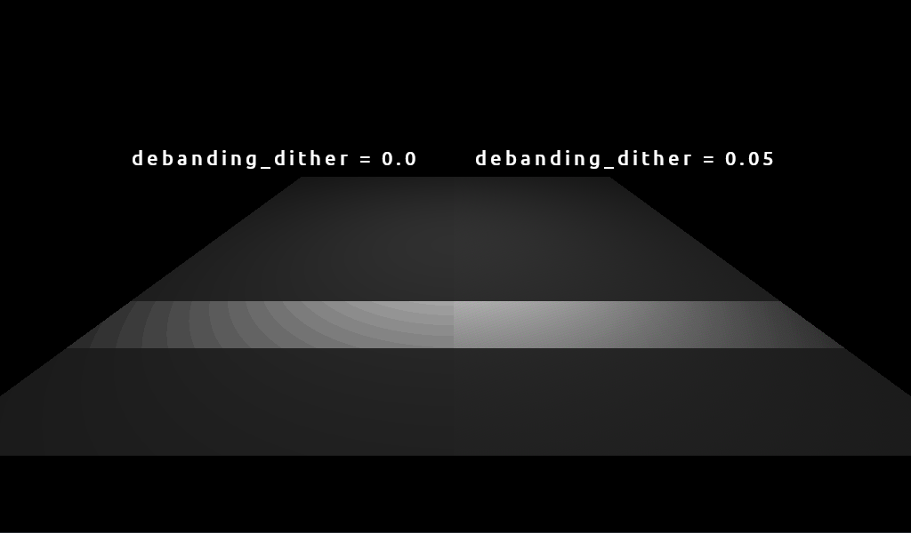

# Debanding material shader
Simple material shader with added noise to fix ugly banding effects. To be used with GLES2 renderer that does not support full-screen debanding. Made for Godot 3.2.x.

## Usage

Copy the `debandingmaterial.shader` -file to your project, create a new ShaderMaterial and load the file into it.

This is basically a SpatialMaterial converted to ShaderMaterial with some unnecessary features removed and debanding added. You can also copy-paste the debanding part fairly easily to your existing shader.

## License

MIT license.

This shader was initially made for use in [Polychoron](https://www.fractilegames.com/polychoron/) game project.
